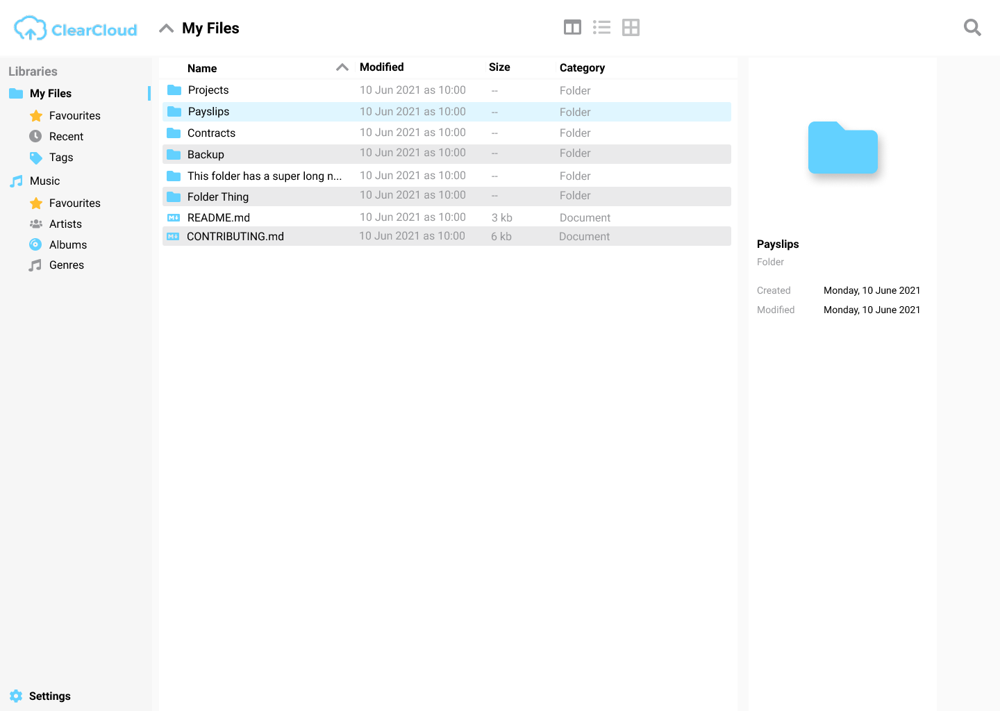

= ClearCloud
:toc: macro

image:https://img.shields.io/docker/v/chappio/clearcloud[Docker Image Version,link="https://hub.docker.com/r/chappio/clearcloud"]
image:https://img.shields.io/github/license/ChappIO/clearcloud[License,link="https://github.com/ChappIO/clearcloud/blob/master/LICENSE"]

A personal file management and sharing application.

toc::[]

== Introduction

== Installation

The project is not ready yet. We provide no installation.

== Development

=== Prerequisites

To set up your development environment you need the following software:

- Docker v20
- Go v1.16
- Node v16
- Yarn v1.22

=== Running a Development Instance

To start the backend:

[source,bash]
----
# Start all dependencies
docker compose up -d

# Optional: download go libs
# This also happens automatically when running other go commands
go get

# Optional: update the api docs
swag init

# Start the backend
go run ./main.go
----

You can now access the API docs at http://localhost:5555/docs/index.html

To start the frontend:

[source,bash]
----
# Open the project folder
cd web

# Install dependencies
yarn

# Start the frontend
yarn start
----

You can now access the application at http://localhost:3000
