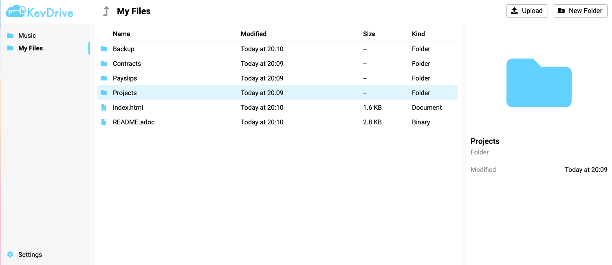

= KeyDrive (formerly ClearCloud)
:toc: macro
:latest-release: preview

image:https://github.com/keydrive/keydrive/actions/workflows/Build.yml/badge.svg[Build,link="https://github.com/keydrive/keydrive/actions/workflows/Build.yml"]
image:https://img.shields.io/github/license/keydrive/keydrive[License,link="https://github.com/keydrive/keydrive/blob/main/LICENSE"]

A personal file management and sharing application.

toc::[]

== Introduction

KeyDrive is a self-hosted file management system which allows you to access your files from anywhere, without the privacy concerns of a cloud service.

== Installation

=== Docker

Docker is probably the easiest way to install KeyDrive. You can find the image on Docker Hub: https://hub.docker.com/r/keydrive/keydrive[keydrive/keydrive].

1. https://docs.docker.com/engine/install[Install Docker]
2. Create a `docker-compose.yml` file:
+
[source,yml,subs="attributes"]
----
version: '3.3'

services:
  keydrive:
    image: ghcr.io/keydrive/keydrive:edge
    restart: unless-stopped
    networks:
      - default
    ports:
      # Here we expose keydrive on port 5555
      - 5555:5555
    volumes:
      # We create a volume for you files
      - /path/to/your/media:/libraries
    environment:
      POSTGRES_HOST: database
      POSTGRES_DB: keydrive
      POSTGRES_USER: keydrive
      POSTGRES_PASSWORD: "ChangeMeToASecurePassword"
  database:
    image: library/postgres:13
    restart: unless-stopped
    networks:
      - default
    volumes:
      # We need to store the database files somewhere
      - /path/to/your/database/storage:/var/lib/postgresql/data
    environment:
      POSTGRES_DB: keydrive
      POSTGRES_USER: keydrive
      POSTGRES_PASSWORD: "ChangeMeToASecurePassword"

networks:
  default:
----
3. Run `docker compose up -d` to start the stack
4. Open KeyDrive on http://localhost:5555 or http://<your-server-ip>:5555

== Development

=== Prerequisites

To set up your development environment you need the following software:

- Docker v20
- Go v1.16
- Node v16
- Yarn v1.22

=== Running Locally

To start the backend:

[source,bash]
----
# Start all dependencies
docker compose up -d

# Optional: download go libs
# This also happens automatically when running other go commands
go get

# Optional: update the api docs
swag init --output ./internal/swagger

# Start the backend
go run ./main.go
----

You can now access the API docs at http://localhost:5555/docs/index.html

To start the frontend:

[source,bash]
----
# Open the project folder
cd web

# Install dependencies
yarn

# Start the frontend
yarn start
----

You can now access the application at http://localhost:3000
